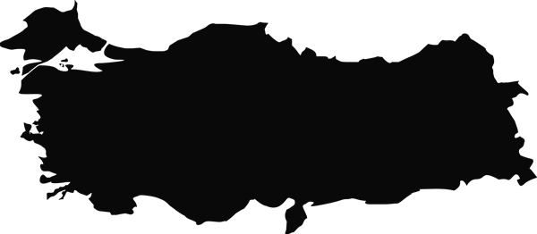

[](http://quantlet.de/)

## [](http://quantlet.de/) **DEDA_Class_SS2018_DictionaryForTurkishSentiment** [](http://quantlet.de/)

```yaml

Name of Quantlet: DEDA_Class_SS2018_DictionaryForTurkishSentiment

Published in: Digital Economy and Decision Analytics (SS 18)

Description: Demonstrating getting data from various websites (web scraping) and analyzing the election rally speeches in Turkey (24.06.2018) by constructing a bridge between Turkish and English through tokenization and translation. 

Keywords: web scraping, Turkish sentiment, Turkish word frequency, election speeches, speech analysis

Author: Cemre Ünal

See also: Erdogan_TextFiles, Erdogan_Manifesto, Ince_Manifesto

Submitted: Wed, June 27 2018 by Cemre Ünal

Output: Agg_RTE FrequentWordsEN.png, Agg_RTE - Word Cloud.png, RTE - Word Cloud.png (x3)

```




### PYTHON Code
```python

#!/usr/bin/env python3
# -*- coding: utf-8 -*-
"""
Created on Fri Jul 20 17:33:56 2018

@author: cemre
"""
import string

import matplotlib.pyplot as plt

from wordcloud import WordCloud

from PIL import Image 

from googletrans import Translator

translator = Translator()


ist = open("1_RTE.txt", "r")

ist = ist.read()


gazi = open("2_RTE.txt", "r")

gazi = gazi.read()


maras = open("3_RTE.txt", "r")

maras = maras.read()


mardin = open("5_RTE.txt", "r")

mardin = mardin.read()


adana = open("6_RTE.txt", "r")

adana = adana.read()


ordu = open("7_RTE.txt", "r")

ordu = ordu.read()


antalya = open("8_RTE.txt", "r")

antalya = antalya.read()


yalova = open("9_RTE.txt", "r")

yalova = yalova.read()


rize = open("10_RTE.txt", "r")

rize = rize.read()


denizli = open("11_RTE.txt", "r")

denizli = denizli.read()


ankara = open("12_RTE.txt", "r")

ankara = ankara.read()

agg = ist+gazi+maras+mardin+adana+ordu+antalya+yalova+rize+denizli+ankara


translator = str.maketrans('', '', string.punctuation)
#print(text.translate(translator))

##CHANGE THE VARIABLE NAME "agg" to "ist", "gazi" etc to get the plots of individual cities
agg = agg.translate(translator).lower()


dat = list(agg.split())
dict1 = {}
for i in range(len(dat)):
    word = dat[i]
    dict1[word] = dat.count(word)


stoplist = open("swNI.csv", "r")
stopwords = stoplist.readlines()
stopwords = [i.replace('"', '') for i in stopwords]
stopwords = [i.replace('\n', '') for i in stopwords]


keys = list(dict1)
keys = [i.replace('"', '') for i in keys]
keys = [i.replace("'", '') for i in keys]
keys = [i.replace("erdogan", '') for i in keys]
filtered_words = [word for word in keys if word not in stopwords]
#filtered_words = [i.replace('i̇', 'i') for i in filtered_words]
dict2 = dict((k, dict1[k]) for k in filtered_words if k in filtered_words)

def SequenceSelection(dictionary, length, startindex = 0): 
    
    lengthDict = len(dictionary)
    if length > lengthDict:
        return print("length is longer than dictionary length");
    else:
        d = dictionary
        items = [(v, k) for k, v in d.items()]
        items.sort()
        items.reverse()   
        itemsOut = [(k, v) for v, k in items]
    
        highest = itemsOut[startindex:startindex + length]
        dd = dict(highest)
        wanted_keys = dd.keys()
        dictshow = dict((k, d[k]) for k in wanted_keys if k in d)

        return dictshow;
    
dictshow = SequenceSelection(dictionary = dict2, length = 8, startindex = 0)

from googletrans import Translator

translator = Translator()


eng_FQwords = []

for fqword in list(dictshow):
    trs = translator.translate(fqword, src = 'tr', dest = 'en')
    eng_FQwords.append(trs.text)
    
def remove_duplicates(values):
    output = []
    seen = set()
    for value in values:
        # If value has not been encountered yet,
        # ... add it to both list and set.
        if value not in seen:
            output.append(value)
            seen.add(value)
    return output

eng_FQwords = remove_duplicates(eng_FQwords)


# Visualising the most frequent words in English
n = range(len(eng_FQwords))
plt.bar(n, dictshow.values(), align='center', color = "red")
plt.xticks(n, eng_FQwords, rotation = 45)
plt.title("Erdogan Aggregate Speeches Most Frequent Words")
plt.tight_layout()
plt.savefig("Agg_RTE FrequentWordsEN.png", transparent = True, dpi=1000)


import numpy as np
from os import path
import os
root_path = os.getcwd()


rte_mask = np.array(Image.open(path.join(root_path, "rte.png")))


filtered_WC = ' '.join(filtered_words)
filtered_WC = filtered_WC.replace('i̇', 'i')
filtered_WC = filtered_WC.replace('"', '')
filtered_WC = filtered_WC.replace("'", '')


# Creating the word cloud of filtered words in english
from googletrans import Translator

translator = Translator()

eng_fil_words = []

for filword in filtered_words:
    trs = translator.translate(filword, src = 'tr', dest = 'en')
    eng_fil_words.append(trs.text)
#    print(eng_fil_words)
 #   eng_fil_words

filtered_WC_eng = ' '.join(eng_fil_words)
#filtered_WC_eng = filtered_WC.replace('i̇', 'i')
filtered_WC_eng = filtered_WC_eng.replace('"', '')
filtered_WC_eng = filtered_WC_eng.replace("'", '')
wordcloud_FW_eng = WordCloud(background_color='white', mask=rte_mask, mode='RGBA').generate(filtered_WC_eng)

plt.figure()
plt.imshow(wordcloud_FW_eng, interpolation='bilinear')
plt.axis("off")
plt.imshow(rte_mask, cmap=plt.cm.gray, interpolation='bilinear', alpha=0.2)
plt.title("Erdogan Election Speech - Aggregate Word Cloud")
plt.savefig("Agg_RTE - Word Cloud.png", transparent=True, dpi=1000)
plt.show()
```

automatically created on 2018-09-04